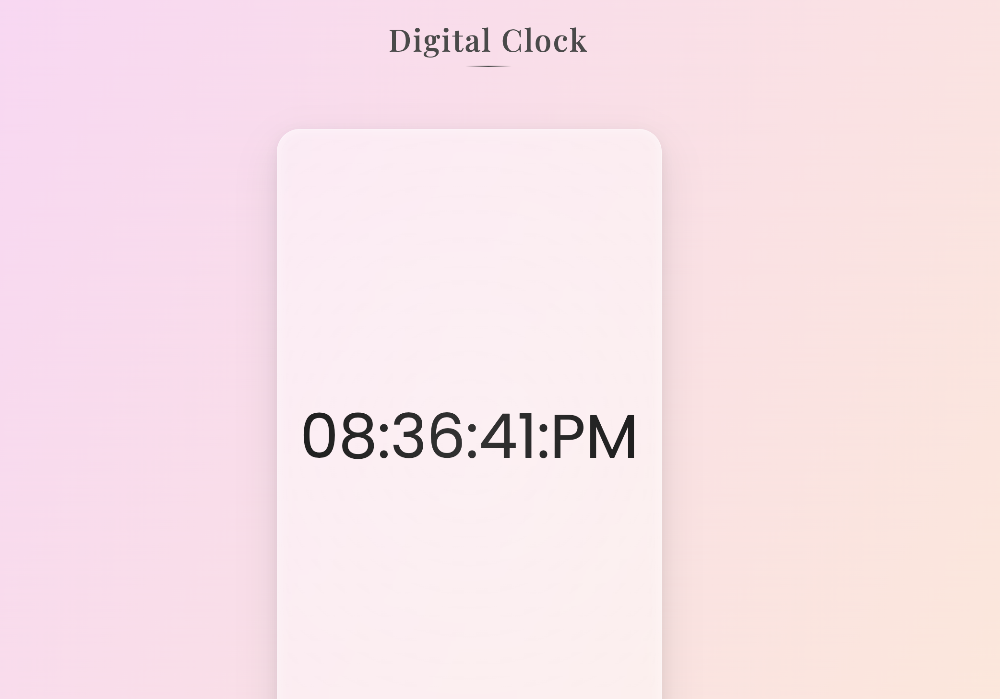

# Reloj Digital Elegante

Un simple reloj digital con diseño moderno y minimalista, construido con HTML, CSS y JavaScript. Tiene una interfaz con efectos visuales suaves y un diseño responsive.

## ✨ Características

- Diseño moderno con efecto glassmorphism
- Animaciones suaves y efectos hover
- Totalmente responsive
- Gradientes elegantes
- Tipografía moderna y legible

## 🚀 Tecnologías Utilizadas

- HTML5
- CSS3
- JavaScript

